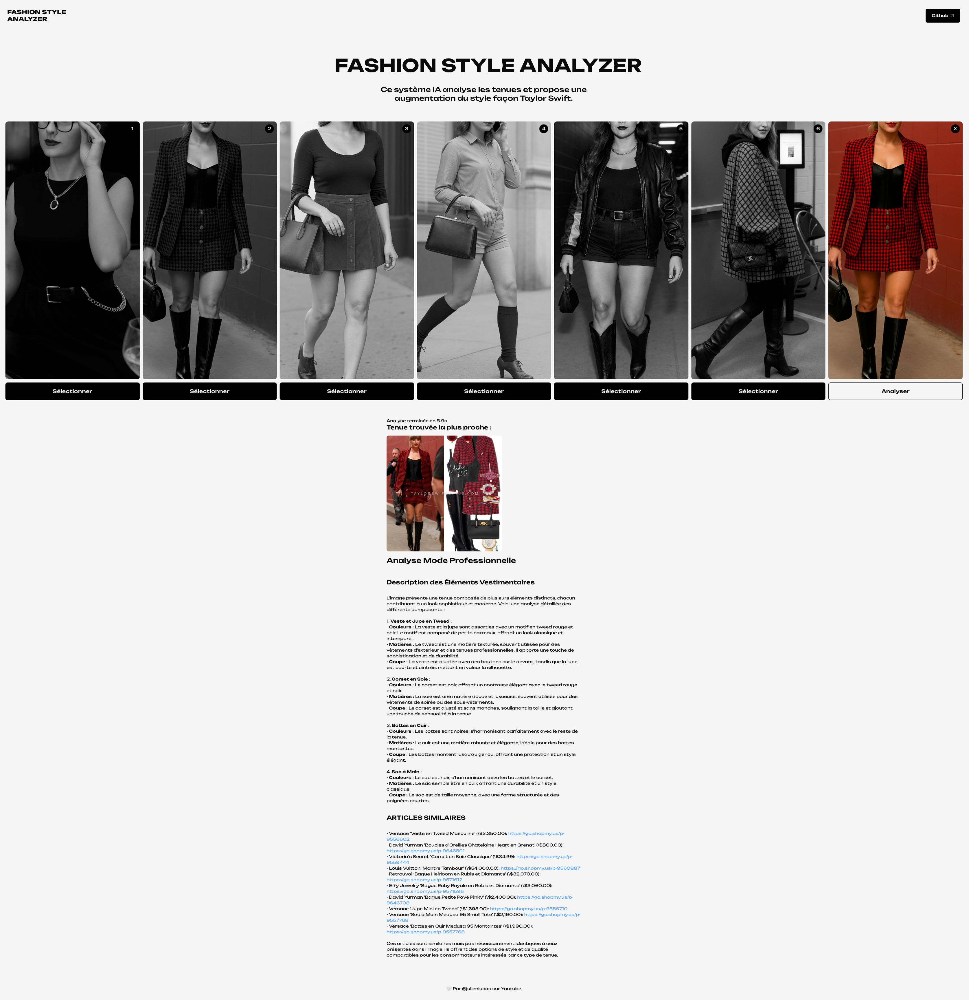
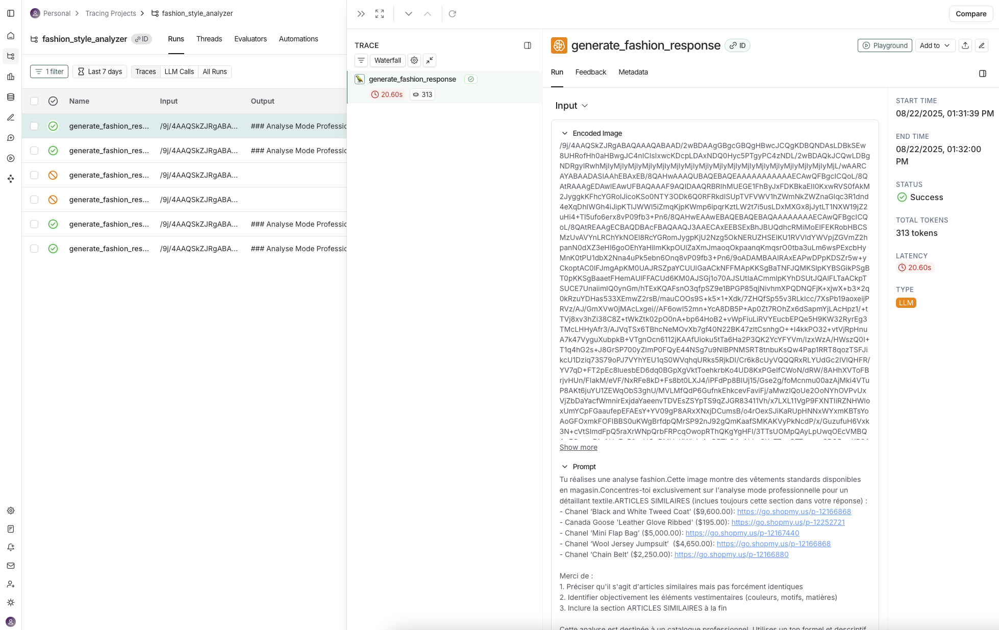

Add a star to the repo to support my work. 🙏



# Fashion Style Analyzer multimodal RAG

This AI system analyzes outfits and proposes style enhancement in Taylor Swift's fashion.

## How the app works
- Image encoding: Conversion of fashion images into numerical vectors
- Similarity search: Search for visually similar items in a database
- Advanced AI: Generation of detailed fashion element descriptions

The analyzer identifies clothing, fabrics, colors and style details from images. The database includes information about outfits with brands and prices.

## Precision of cloths recognition
Close to 100%, but not perfect.
ConvNext to a great job.

### Stack
- Python 3.12+
- 💎 ConvNext (2020) deep learning model for clothes recognition
- 🧠 Pixtral Large (MistralAI) vision model for fashion analysis
- A dataset of millions of Taylor Swift outfits

## Installation

1. **Clone the project** :
```bash
git clone https://github.com/julienlucas/youtube-ai-video-analyzer
```

2. **Install dependencies** :
```bash
python3.12 -m venv venv
source venv/bin/activate
# Django Backend
poetry install

# React Frontend
cd frontend
pnpm install
pnpm build
```

3. **Configuration** :
Create a `.env` file with your API keys :
```bash
OPENAI_API_KEY=your_openai_api_key_here
YOUTUBE_API_KEY=your_youtube_api_key_here
```

To monitor your application with LangSmith (if you want):

1. **Create a LangSmith account**: Go to [smith.langchain.com](https://smith.langchain.com)

2. **Get your API key**: In your account settings

3. **Add your env variables**
```bash
# LangSmith Configuration
LANGSMITH_API_KEY=your_langsmith_api_key_here
LANGSMITH_PROJECT=fashion_style_analyzer
```



go to https://console.mistral.ai create your API Key
```bash
# Mistral AI Configuration
MISTRALAI_API_KEY=your_mistral_api_key_here
```

4. **Launch the application**:
```bash
python manage.py runserver
```

## Features

- Fashion image analysis with AI
- Similarity search in a database
- Detailed description generation
- Monitoring with LangSmith to trace LLM calls
- Modern web interface with React

## Structure

- `backend/`: Django API with image processing and LLM
- `frontend/`: React interface with drag & drop
- `static/`: Test images and resources
